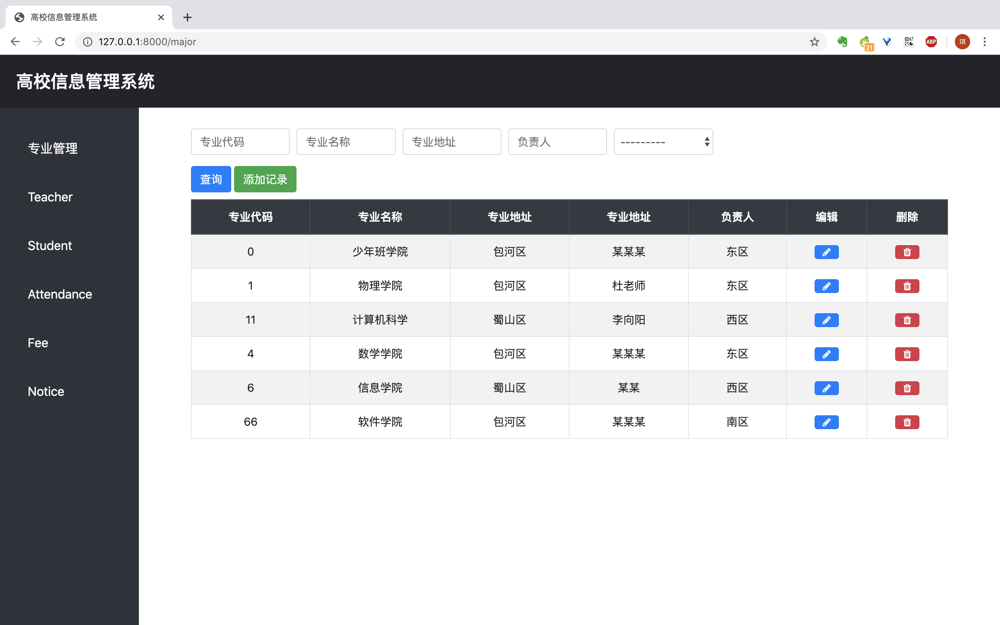
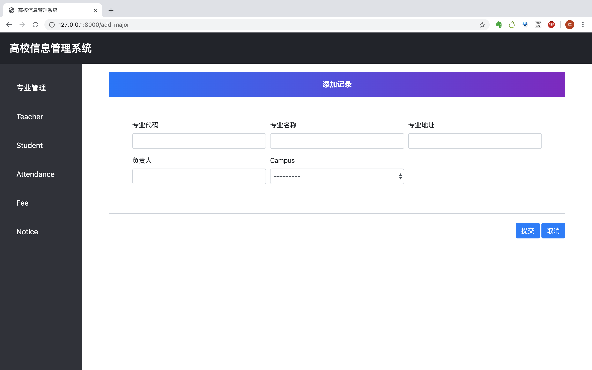
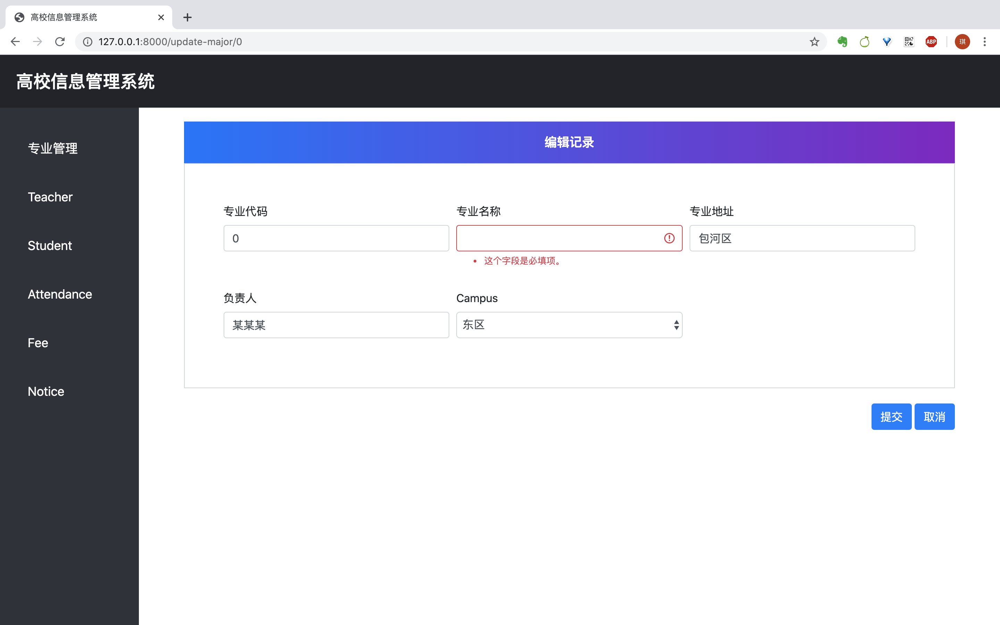

在后端(本目录下)执行以下以下命令以安装依赖和初始化数据，建议创建虚拟环境并在激活虚拟环境再执行下述命令

```
pip install -r requirements.txt  
python manage.py migrate
python manage.py loaddata initial_data.json
python manage.py loaddata schoolmanagement\fixtures\initial_data.json
python manage.py runserver
```

在http://127.0.0.1:8000/admin/ 下登录

admin 

admin

可以进入数据库后端，请任意尝试，以发现数据库中还有的数据不一致的bug。


已实现的功能：

具有一定的出错处理功能

​	通过触发器实现了：学籍异动时触发更新学生班级信息

​	通过验证器实现了：增加或删除学籍异动信息时，如果原班级和转出班级不一致或现班级和新班级不一致，抛出异常；学生选择相同的课程时，抛出阻止信息

​	通过(联合)主键实现了：学籍异动中的俩种情况最多发生一次；有关联信息无法删除


\\\\ TODO

后端还需要实现views

可以考虑在后端用django自带界面实现查询功能

教师离职

学生毕业

年级和入学时间的一致性(考虑学籍异动问题)


下面放一些展示：


转专业


删除这个转专业信息


抛出异常


异常原因：该生记录不可删除

原因如下：

我后来又进行了一次降级操作，导致我现在在计科二班


---

## “专业管理”前端

打开http://127.0.0.1:8000/，重定向到major页。

左边栏用来切换页面（现在只有“专业管理”是有用的）。



查询和删除按钮还没有实际作用。

查询：

```html
<button type="submit" class="btn btn-primary">查询</button>
```

删除：

```html
<a href="" class="badge badge-danger"><i class="fa fa-trash"></i></a>
```

转到/delete-major/major.id


点击添加记录：



点击编辑：


点击提交后，如果有错误，会显示：



现在的编辑页面对模型所有项都可以修改，专业代码不可修改等约束建议在后端实现。

## 其他改动

* settings.py：注释掉了csrf检验（这个实验就不考虑安全问题了，也没有用户登录机制）
* urls.py：加入相关的页面地址
* views.py：写了简易的views用来测试前端的错误显示效果