# Lab 3 -- Database Application Development

项目地址：https://github.com/zkdliushuo/UniInfoManagement

(由于服务器不稳定的原因，如果到时候打不开请老师给我说让我打开)

部署好的系统入口：http://121.89.166.136:8080/index

组员：刘硕 万琪 牛田 张鑾翔

[TOC]


## 实验概述

​	在实验二的基础上设计开发了一个高校信息管理系统。存储了校区信息、学生信息、教师信息、班级信息、学籍变动等数据，并且在这些数据的基础上，使用Django+MySQL实现了校区管理、专业管理、学生信息管理等一系列功能。我们实现了全部的前端和后端操作，目前没有引入登录用户验证等权限操作。

### 实验环境

- Django2.0.2 (SQLite3)
- Bootstrap
- Python 3.8
- 实验系统：Ubuntu 18.04

### 安装运行

```shell
$ git clone https://github.com/zkdliushuo/UniInfoManagement.git

$ cd UniInfoManagement/backend/schoolmanagement-master/

$ pip install -r requirements.txt

$ python manage.py migrate

$ python manage.py loaddata initial_data.json

$ python manage.py loaddata schoolmanagement\fixtures\initial_data.json

$ python manage.py runserver
// 推荐在虚拟环境下执行
```

### 登录界面

​	之后在访问http://127.0.0.1:8000/index 既可以登录系统，此时的界面应该是如下的：

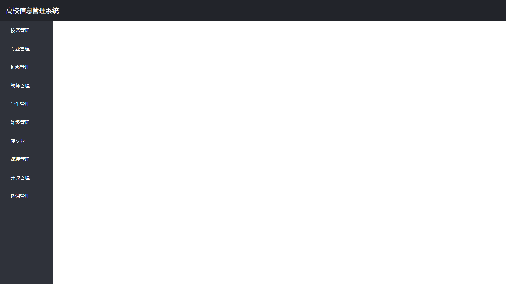

左侧的sidebar罗列出了所有的管理选项，对应于数据库中所有的table.

### 实现的功能

​	我们组实现了实验手册中的全部要求，包括：所有table的所有信息的增删查改，关联信息保护防止误删除，工号、代码、学号等部分主键信息不可删除的要求，灵活搜索功能：包括按照单个字段和多个字段搜索，教师离职导致的课程移交操作，学生毕业之前不允许删除，以及一定的出错处理，包括：学生重复修读同一课程号的课程、删除学籍异动信息可能导致的信息不一致清况等。

## 系统总体设计

### 系统模块结构

#### 项目目录结构

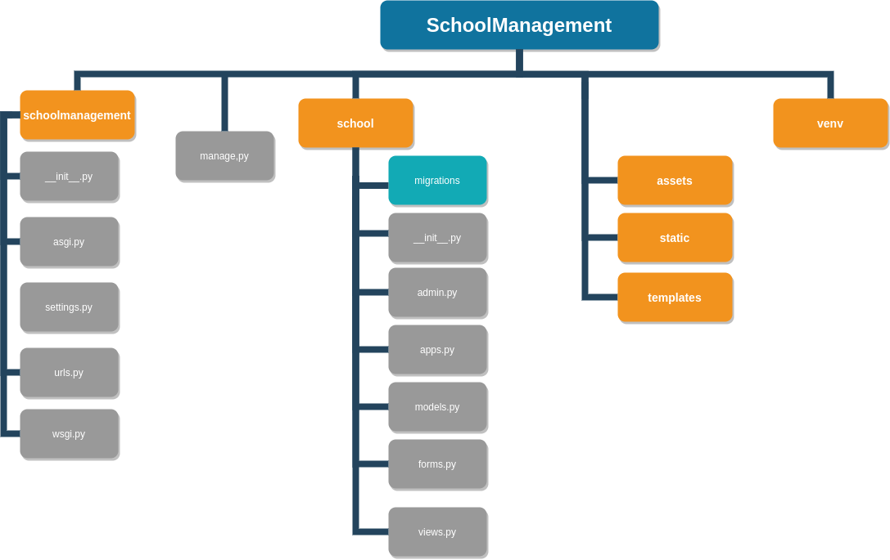

##### school文件夹

​	我们的程序代码主要是在school文件夹下面。

​	models.py 存放的是数据库代码，包括：Campus，Major，Classes，People，Student，Teacher，StudyDelay，ChangeMajor，Course，Startedcourse，ChooseCourese。分别对应校区，专业，学生，教师，学籍异动(抽象类，不在数据库中建立相应的table)。

​	views.py是另外一个十分的文件，描述了我们处理增删查改和离职等请求操作的逻辑。

​	forms.py主要用来描述我们需要用到的表单信息，对于大部分table其表单都和本身的字段名相同。但为了支持离职操作，我们把开课课程表的表单进行了一些处理。

​	school下的其它文件和文件夹都是用来服务于Django的系统运行。

##### schoolmanagement文件夹

​	这里主要有俩个文件很重要。settings.py提供了Django的定制服务，我们在这里设置了数据库为SQLite3(Django原生支持的数据库)，设置部署服务器的相关信息和其它信息。

​	urls.py用来处理路由转发，为了简单，我们把所有路由设置为单层路由。

##### manage.py

​	用来和Django交互，执行命令行操作。

##### templates

​	存放前端网页设计。

##### static

​	存放图标等信息。

##### venv

​	虚拟环境依赖。

### 工作流程

​	按照从总体到局部的方式描述工作流程。

​	适用GET方法请求index后，该Http请求发送到urls.py(Django的路由器)，之后根据路由表的设置，将该访问转发给views的home_view方法。在这里，我们返回一个空表单给前端。于是可以看到这张图：


​	点击左侧任一按钮，即可跳转到对应界面。以点击教师管理为例(为了说明教师离职功能)，点击其它按钮的工作流程类似。点击之后，进入teacher-view。

​	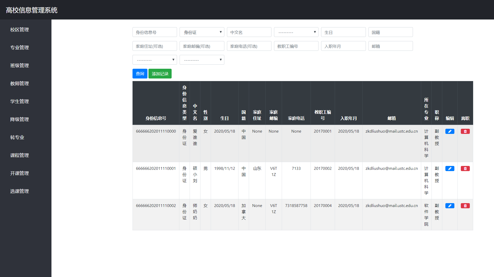

​	在这里，和其它每个界面一样，我们设计了四种操作：

​	查询：	在上侧的表单中填入任意的查询信息组合，然后点击查询就可以在这个界面(teacher-view)下显示所有查询结果。关于查询等操作的结果，后面会有详细的介绍。

​	添加记录：	点击添加记录按钮，系统会跳转到添加一个教师的界面，即add-teacher-view，如下：

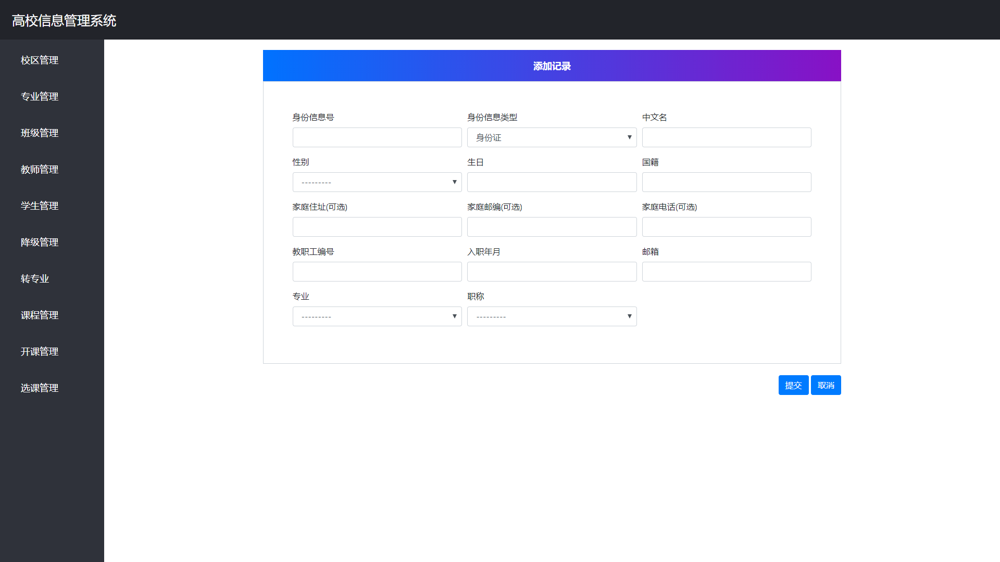

​	填写对应的信息点击提交就可以尝试提交这个增操作到数据库，如果不符合增操作的条件，会在当前界面add-teacher-view的对应的字段产生报错信息。如果点击取消，就可以返回到前面的界面，即teacher-view.

​	修改操作：	点击在对应教师的每一行的右侧的绿色按钮即可跳转到修改操作的界面，即update-teacher-view，如下：

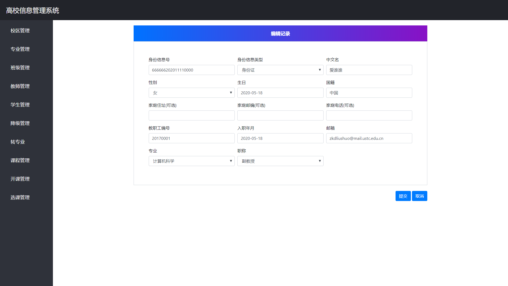

​	更新操作和增加操作类似。在对应的字段会有对应的报错信息的提示。如修改教师的教职工编号就会有报错。

​	移除操作：	点击对应教师右侧的红色按钮可以进行教师的离职操作，相应的页面跳转到leave-teacher-view视图，如下：

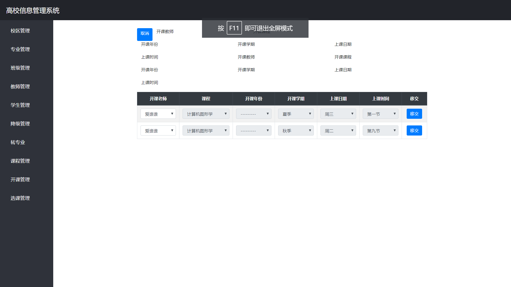

​	可以看到这里列出了所有该教师带的课程（上方的一些文字是前端的小bug，没来的及修改，请忽略），只有开课教师一栏是可修改的，其它栏只是用来提示是哪门课需要移交。选择好教师后，点击右侧移交。系统在当前页面重新显示剩下的这个教师代理的课程，如下：

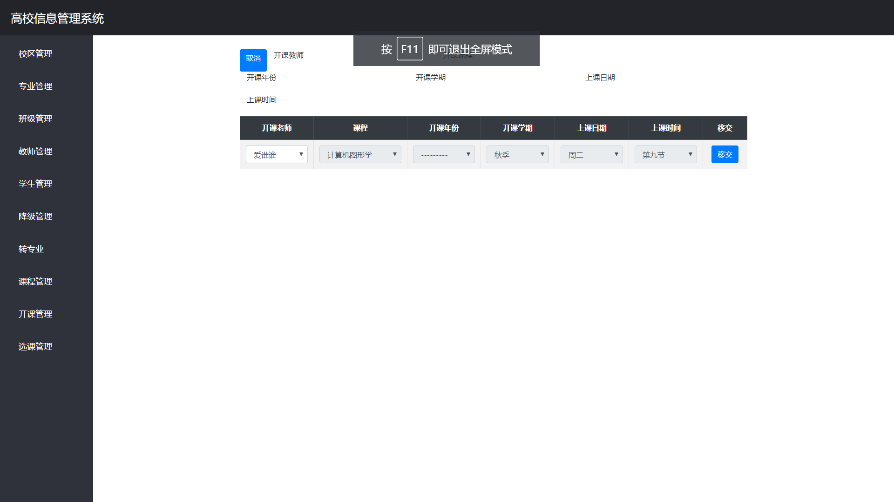

​	再次移交这个教师就会被删除(离职完成)，如下：

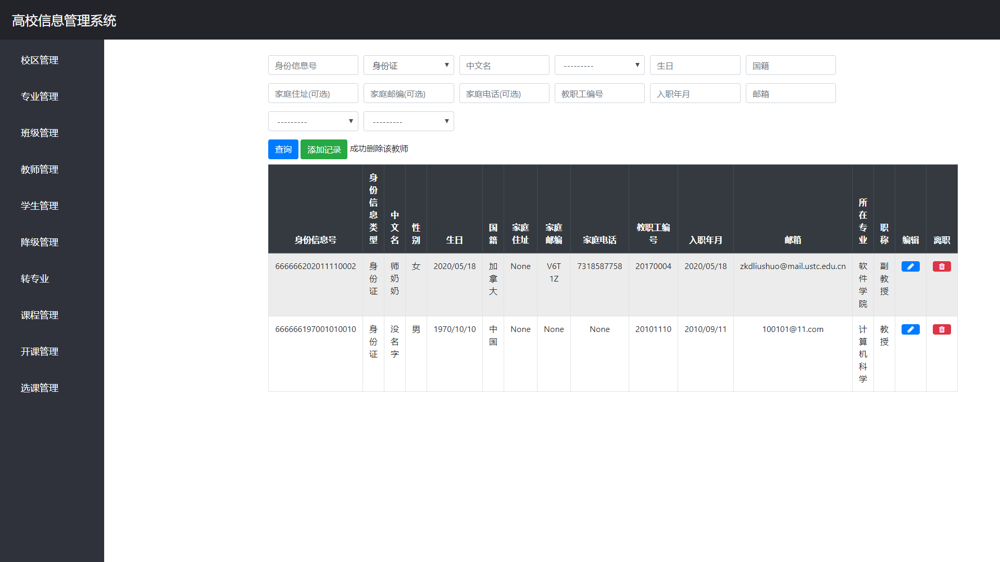

​	其它的操作于此类似。

### 数据库设计

​	数据库的设计和实验手册的有一些微小的出入，主要在日期的设置上。下面分别介绍各个表的设计：

#### Campus 校区

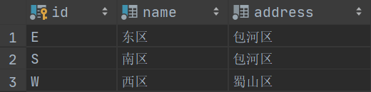

​	campus平平无奇，没有外键等。

#### Major 专业

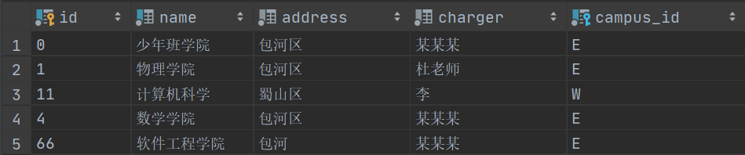

​	外键是campus。设置了级联删除的保护。设置代码如下：

```python
campus = models.ForeignKey(Campus, verbose_name='校区', on_delete=models.PROTECT)
```

​	on_delete=models.PROTECT 表示如果在删除campus的元组的时候，如果存在对这个元组的外键引用，就不能删除，并且触发一个ProtectedError错误信息。我们通过处理这个信息，在前端可以显示相应的报错。

​	后面的保护级联删除的操作是类似的，我就不再列出相关代码。

#### Classes 班级

​	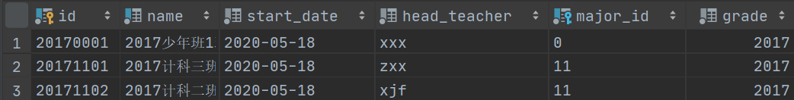

​	班级部分设置了外键专业，同样有级联删除的保护设置。班级的所在年级属性(grade)被我设置为了一个选择集合，可以在1984年到2020年之间任意选择(如果以后有机会，把这里可以用更好的动态办法设置为自动更新到今年，现在的2020是我手动设置的)。

#### People 教师和学生的父表

​	People表是数据库的抽象基类，是Teacher和student的抽象父类。其在数据库中没有相对于的实例化表，因此无法列出其数据库中的实例。

​	people的对应在Django的ORM操作序列如下：

```python
class People(models.Model):
    def idvalidator(self):
        if len(self) != 18:
            raise ValueError('请输入18位身份证号码,您只输入了%s位' % len(self))

    identification = models.CharField('身份信息号', primary_key=True, max_length=18, unique=True, validators=[idvalidator])
    ID_CARD = '身份证'
    PASSPORT = '护照'
    ID_TYPE_CHOICES = (
        (ID_CARD, '身份证'),
        (PASSPORT, '护照'),
    )
    id_type = models.CharField('身份信息类型', max_length=7, choices=ID_TYPE_CHOICES, default=ID_CARD)
    chinese_name = models.CharField('中文名', max_length=10, null=False)
    MALE = '男'
    FEMALE = '女'
    GENDER_TYPE_CHOICES = (
        (MALE, '男'),
        (FEMALE, '女'),
    )
    gender_type = models.CharField('性别', max_length=3, choices=GENDER_TYPE_CHOICES)
    birth_date = models.DateField('生日')
    nationality = models.CharField('国籍', max_length=20)
    family_addr = models.CharField('家庭住址(可选)', max_length=200, null=True, blank=True)
    family_post_code = models.CharField('家庭邮编(可选)', max_length=6, null=True, blank=True)
    family_phone_num = models.CharField('家庭电话(可选)', max_length=11, null=True, blank=True)

    # 抽象类，用来继承，可以再考虑是不是抽象(是否需要多表)
    class Meta:
        abstract = True
```

​	People集合了Teacher和Student实体的共同属性，**并且给身份证号和护照号均设置了验证器（验证编号长度必须为18位**，我也不知道护照号是多少位qwq，为了简洁，这里统一设置为了18位，可以很简单地改成对身份证和护照号分别验证）。just for real!

​	People没有外键，外键都加在了其子类上。下面介绍其子类。

#### Teacher 教师

​	教师的table比较大，不好截屏，这里把他的DDL定义列出来：

```sql
create table school_teacher
(
    identification   varchar(18)  not null
        primary key,
    id_type          varchar(7)   not null,
    chinese_name     varchar(10)  not null,
    gender_type      varchar(3)   not null,
    birth_date       date         not null,
    nationality      varchar(20)  not null,
    family_addr      varchar(200),
    family_post_code varchar(6),
    family_phone_num varchar(11),
    teacher_num      varchar(10)  not null
        unique,
    join_date        date         not null,
    email            varchar(254) not null,
    rank             varchar(7)   not null,
    major_id         varchar(3)   not null
        references school_major
            deferrable initially deferred
);

create index school_teacher_major_id_9ae82cf0
    on school_teacher (major_id);
```

​	其身份证件号identification为主键，教职工号teacher_num要求唯一unique，所在专业是外键引用Major类（school_major）。

#### Student 学生

​	和教师及其类似。只是把教职工号改成学号，外键的专业改成班级。DDL语言定义如下：

```sqlite
create table school_student
(
    identification   varchar(18)  not null
        primary key,
    id_type          varchar(7)   not null,
    chinese_name     varchar(10)  not null,
    gender_type      varchar(3)   not null,
    birth_date       date         not null,
    nationality      varchar(20)  not null,
    family_addr      varchar(200),
    family_post_code varchar(6),
    family_phone_num varchar(11),
    student_id       varchar(10)  not null
        unique,
    start_date       date         not null,
    email            varchar(254) not null,
    classes_id       varchar(9)   not null
        references school_classes
            deferrable initially deferred
);

create index school_student_classes_id_02b2ecbf
    on school_student (classes_id);
```

#### StudyEvent 学籍异动

​	是StudyDelay和ChangeMajor表的抽象基类。不详细描述。

#### StudyDelay 降级

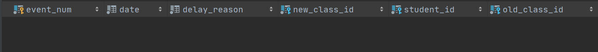

​	该表有主键event_num异动编号作为主键，俩个外键引用在classes班级表上，另外有一个外键引用在student表上。注意这里没有对任何一个外键设置级联删除保护，相反地我们设置了级联删除的一致性检查工作，这个工作通过适用Django的signal机制实现的触发器完成，**这个是实验手册上并没有要求，但是我们觉得必要的**。

​	这个触发器可以同时作用在studydelay和changemajor类上，其代码如下：

```
# 删除异动的触发器
@receiver(pre_delete, sender=ChangeMajor)
@receiver(pre_delete, sender=StudyDelay)
def post_delete_study_event(sender, instance, **kwargs):
    if instance.student.classes.id == instance.new_class.id:
        instance.student.classes = instance.old_class
        instance.student.save()
    else:
        raise ValidationError(
            message='该生记录不可删除',
            code='unique_together',
        )


@receiver(pre_save, sender=ChangeMajor)
@receiver(pre_save, sender=StudyDelay)
def post_save_study_event(sender, instance, **kwargs):
    if instance.student.classes.id == instance.old_class.id:
        instance.student.classes = instance.new_class
        instance.student.save()
    else:
        raise ValidationError(
            message='转出班级与学生班级不匹配',
            code='unique_together',
        )
```

​	这个触发器的工作大概就是验证如果删除了，是不是会产生孤立的另外一条异动信息。

#### ChangeMajor 转专业

​	和StudyDelay类似

#### Course 课程

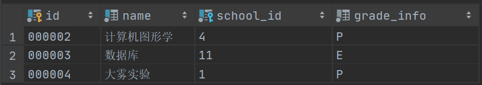

​	课程有主键作为课程号，还有课程名，以及外键引用开课的专业，还有考试方式。P表示当堂答辩，E表示考试。

#### StartedCourse 开课

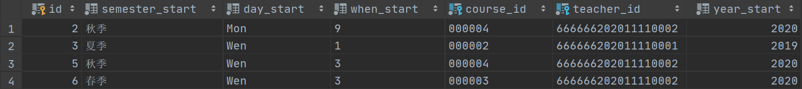

​	开课的这里设置了开课的编号(是默认的id)，以及外键是课程和教师，事实上这个表尽管有主键，其实是课程表和教师表的一个多对多关系。

#### ChooseCourse 选课

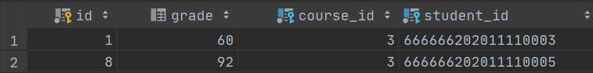

​	选课表引用了俩个外键，一个是开课的课程号，一个是选课的学生号（学生的身份信息）。

​	保存了成绩信息，设置约束为小于等于100。

## 系统详细设计

### 路由模块

#### 模块的输入

​	路由模块的代码如下：

```python
path('admin/', admin.site.urls),
    path('index', views.home_view, name=''),

    path('major', views.major_view, name='major'),
    path('update-major/<pk>', views.update_major_view, name='update-major'),
    path('add-major', views.add_major_view, name='add-major'),
    path('delete-major/<pk>', views.delete_major_view, name='delete-major'),


    path('campus', views.campus_view, name='campus'),
    path('update-campus/<pk>', views.update_campus_view, name='update-campus'),
    path('add-campus', views.add_campus_view, name='add-campus'),
    path('delete-campus/<pk>', views.delete_campus_view, name='delete-campus'),

    path('classes', views.classes_view, name='classes'),
    path('update-classes/<pk>', views.update_classes_view, name='update-classes'),
    path('add-classes', views.add_classes_view, name='add-classes'),
    path('delete-classes/<pk>', views.delete_classes_view, name='delete-classes'),

    path('teacher', views.teacher_view, name='teacher'),
    # path('leave-teacher/<pk>', views.teacher_view, name='teacher'),
    path('update-teacher/<pk>', views.update_teacher_view, name='update-teacher'),
    path('add-teacher', views.add_teacher_view, name='add-teacher'),
    path('delete-teacher/<pk>', views.delete_teacher_view, name='delete-teacher'),

    path('student', views.student_view, name='student'),
    path('update-student/<pk>', views.update_student_view, name='update-student'),
    path('add-student', views.add_student_view, name='add-student'),
    path('delete-student/<pk>', views.delete_student_view, name='delete-student'),

    path('study-delay-event', views.study_delay_event_view, name='study-delay-event'),
    path('update-study-delay-event/<pk>', views.update_study_delay_event_view, name='update-study-delay-event'),
    path('add-study-delay-event', views.add_study_delay_event_view, name='add-study-delay-event'),
    path('delete-study-delay-event/<pk>', views.delete_study_delay_event_view, name='delete-study-delay-event'),

    path('change-major-event', views.change_major_event_view, name='change-major-event'),
    path('update-change-major-event/<pk>', views.update_change_major_event_view, name='update-change-major-event'),
    path('add-change-major-event', views.add_change_major_event_view, name='add-change-major-event'),
    path('delete-change-major-event/<pk>', views.delete_change_major_event_view, name='delete-change-major-event'),

    path('course', views.course_view, name='course'),
    path('update-course/<pk>', views.update_course_view, name='update-course'),
    path('add-course', views.add_course_view, name='add-course'),
    path('delete-course/<pk>', views.delete_course_view, name='delete-course'),

    path('started-course', views.started_course_view, name='started-course'),
    path('update-started-course/<int:pk>', views.update_started_course_view, name='update-started-course'),
    path('add-started-course', views.add_started_course_view, name='add-started-course'),
    path('delete-started-course/<int:pk>', views.delete_started_course_view, name='delete-started-course'),

    path('select-course', views.select_course_view, name='select-course'),
    path('update-select-course/<int:pk>', views.update_select_course_view, name='update-select-course'),
    path('add-select-course', views.add_select_course_view, name='add-select-course'),
    path('delete-select-course/<int:pk>', views.delete_select_course_view, name='delete-select-course'),
```

​	其接受浏览器发来的url请求，处理根url下的其它字段，解析其中的参数字段，如上面的<int:pk>，分别得到对应的路由路径。

​	路由模块还接受来自views的输入，用来在视图函数中，通过选择重定向的路径，直接返回相应的页面进行渲染。

#### 模块的输出

​	输出的值主要是作为views中的函数的参数传入，主要包括：

request：Django支持的Http报头格式，包括了报头信息，验证的Token等。

参数：一般在update和delete的时候在url后面附着一个字段表示需要操作的元组的主键。这个参数被这个模块传给对应的视图函数。

### 表单模块

#### 模块输入

​	这个模块的输入主要是从request中得到输出的表单，以及从Model中得到一个表的元组实例。如下：

```
form = forms.StudentForm(request.POST, instance=student)
```

​	在这里，StudentForm是Student表模型的子类。实例化的一个StudentForm对象的俩个初始参数为request.POST, instance=student。request.POST表示POST方法提交的表单，其会被作为这个form的data值，instance=student会被作为这个form的比较值，用来判断哪些字段被修改，以及在save和delete时验证所有字段是否合法、验证所有触发器是否被触发。

#### 模块输出

​	这个表单类的输出全部都是作为前端的渲染域的输入。这涉及的东西很前端和工程化，就不再详细介绍。

### 视图模块

views.py

#### 模块输入

​	视图模块是处理业务的主模块，其处理的输入包括了前端输入的表单和后端数据库的数据。

#### 模块的输出

​	对于POST上来的表单的save、delete等操作，模块的输出是将相应修改加到数据库里面，对于GET请求，模块的输出是返回相应的前端文件供渲染。

一些特殊的功能实现我也作为模块来描述，列在下面：

### 教师离职模块

```python
def delete_teacher_view(request, pk):
    try:
        teacher = models.Teacher.objects.get(pk=pk)
    except ObjectDoesNotExist:
        return redirect('teacher')
    if request.method == 'POST':
        form = forms.StartedCourseInfoForm(request.POST)
        if form.is_valid():
            pass
        ret = {}
        for key, value in form.data.items():
            if value:
                ret[key] = value
        del ret['csrfmiddlewaretoken']
        del ret['teacher']
        try:
            started_course = models.StartedCourseInfo.objects.get(**ret)
        except ObjectDoesNotExist:
            messages.error(request, '错误：没有这个条目')
            return redirect('teacher')
        form = forms.StartedCourseInfoForm(request.POST, instance=started_course)
        if form.is_valid():
            form.save()
            courses = models.StartedCourseInfo.objects.filter(teacher=teacher)
            print(courses)
            if courses.exists():
                all_course_forms = []
                for each in courses:
                    all_course_forms.append(forms.TobeChangedStartedCourseInfoForm(instance=each))
                return render(request, 'school/leave_started_course.html', context={'forms': all_course_forms})
            else:
                try:
                    teacher.delete()
                except ProtectedError:
                    messages.error(request, '错误：存在其它关联信息，不可删除')
                    return redirect('teacher')
                messages.success(request, "成功删除该教师")
                return redirect('teacher')
    courses = models.StartedCourseInfo.objects.filter(teacher=teacher)
    if courses.exists():
        all_course_forms = []
        for each in courses:
            all_course_forms.append(forms.TobeChangedStartedCourseInfoForm(instance=each))
        return render(request, 'school/leave_started_course.html', context={'forms': all_course_forms})
    else:
        try:
            teacher.delete()
        except ProtectedError:
            messages.error(request, '错误：存在其它关联信息，不可删除')
            return redirect('teacher')
        messages.success(request, "成功删除该教师")
        return redirect('teacher')
```

​	这部分的代码如上。

#### 模块输入

​	模块获取前端输入的request和pk，其中pk是代表需要离职的教师的主键，request中保存了POST上来的表单。

#### 模块输出

在程序中，适用pk获得待离职教师的实例：

```
teacher = models.Teacher.objects.get(pk=pk)
```

​	然后用这个实例，获得这个老师开的全部课程。

```
courses = models.StartedCourseInfo.objects.filter(teacher=teacher)
```

​	对于request的方法是GET的，表示其是刚刚点击delete教师的操作，把上面的courses返回给前端，以显示出来所有待移交的课程

```
return render(request, 'school/leave_started_course.html', context={'forms': all_course_forms})
```

​	这里的all_course_forms其实就是用courses做成的表单。

​	对于request的方法是POST的，表示其是要把待移交的课程的新教师POST上来了。这时候先得到这个POST上来的表单：

```
form = forms.StartedCourseInfoForm(request.POST)
```

​	然后取出表单里面没有作用的字段以及教师字段（如果用了新教师字段，在开课数据库里将找不到任何课程），把剩余的字段做成python的字典ret，放到数据库里查询

```
started_course = models.StartedCourseInfo.objects.get(**ret)
```

​	得到了待移交的课程后，就把这个课程的教师更新成提交上来的新教师，然后再去按照pk得到实例的教师，看看现在这个老师是否还有待移交的课程。

```
courses = models.StartedCourseInfo.objects.filter(teacher=teacher)
```

​	如果没有待移交课程，删除这个教师，重定向回teacher-view视图。否则，继续之前的操作，将剩余的待开课课程转发给前端的leave-teacher视图。

### 学生毕业模块

#### 模块输入

​	数据库中待删除学生的外键班级的所在年级信息。

#### 模块输出

​	按照输入的学生的年级信息，判断其和今年是否相差四年。如果相差四年及以下，就不允许删除。

​	这里还有优化的空间，因为按照国内的计算方式，下半年改升级了。有机会就改掉这个小bug。但无伤大碍。

### 触发器的验证模块

​	学籍异动情况下的触发器设置如下：

```python
# 删除异动的触发器
@receiver(pre_delete, sender=ChangeMajor)
@receiver(pre_delete, sender=StudyDelay)
def post_delete_study_event(sender, instance, **kwargs):
    if instance.student.classes.id == instance.new_class.id:
        instance.student.classes = instance.old_class
        instance.student.save()
    else:
        raise ValidationError(
            message='该生记录不可删除',
            code='unique_together',
        )


@receiver(pre_save, sender=ChangeMajor)
@receiver(pre_save, sender=StudyDelay)
def post_save_study_event(sender, instance, **kwargs):
    if instance.student.classes.id == instance.old_class.id:
        instance.student.classes = instance.new_class
        instance.student.save()
    else:
        raise ValidationError(
            message='转出班级与学生班级不匹配',
            code='unique_together',
        )
```

#### 模块输入

​	当前的操作的状态，主要用到的是pre_delete和pre_save，分表表示这个元组的删除前和保存前。

​	另一个输入是发送者，只监听ChangeMajor和StudentDelay这俩个表。

​	还有其它的输入就是来自数据库了。这里的数据一致性检查比较简单，就是想验证在删除学籍异动时，不可以有另外一个学籍异动信息改变了学生的现班级；保存学籍异动时，学籍异动信息中输入的原班级信息不可以和学生现在的班级不一致。

#### 模块的输出

​	异常情况下这个模块的输出时触发ValidationError。我在视图函数中的对应位置监听了这个异常，以可以在前端显示错误。

​	正常情况下就是去执行相关学生的班级信息的更新。

### 专业等的代码、学号、工号不可修改模块

以更新班级代码为例

```python
form = forms.ClassesForm(request.POST, instance=classes)
        if 'id' in form.changed_data:
            form.errors.clear()
            form.errors['id'] = '错误，班级代码不可修改'
            return render(request, 'school/update_classes.html', context={'form': form})
```

#### 模块输入

​	POST上来的表单以及待更新班级在数据库中的实例。

#### 模块输出

​	这里用了Django中的表单的属性changed_data，发现班级代码被修改的话，就在errors_list中加上一个报错信息，然后返回这个报错信息给当前页面。

注:由于时间原因我们组没有来得及画模块的流程图。我已经尽量在上面把流程详细描述了，我们也会尽快补上这一部分。

## 系统实现与测试

### 专业管理功能

1. 运行界面

   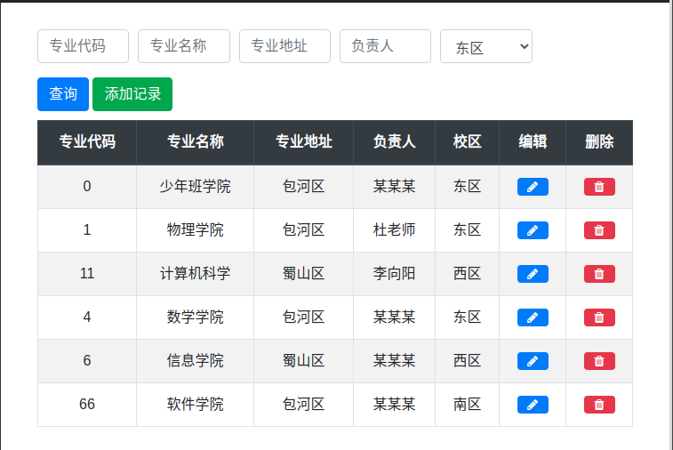

2. 实现

   测试结果

      运行场景
      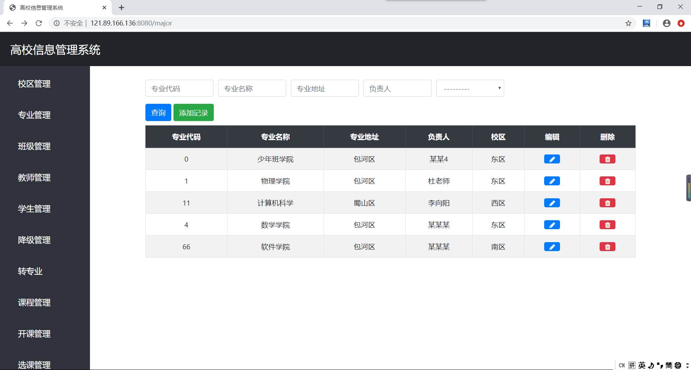
      增加过程
      
      增加结果
      
      非主键查询
      
      主键查询
      
      外键查询
      
      专业代码不可编辑，编辑失败
      
      不编辑专业代码的编辑结果
      
      有关联信息，不可删除的校区
      

   ### 学生管理功能

      运行场景
      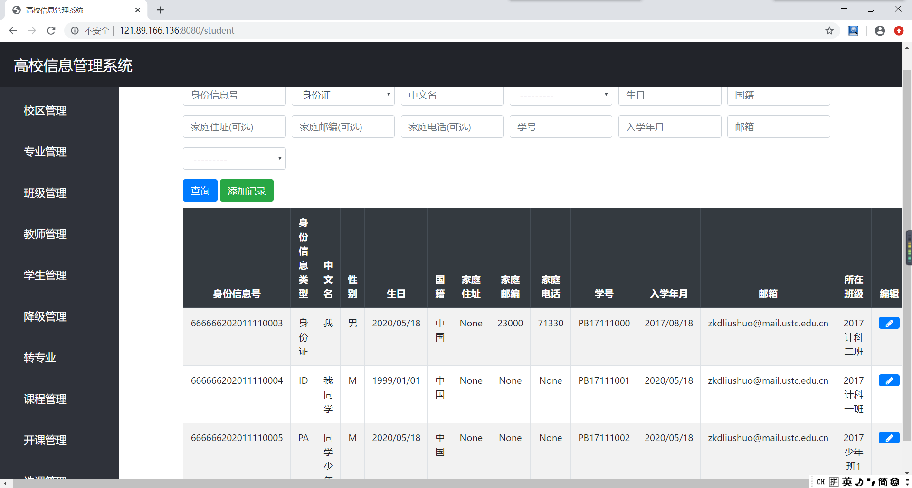
      增加过程
      
      增加结果
      
      复合查询
      
      编辑过程
      
      编辑结果
      
      不可以删除非毕业学生
      

   ### 教师管理功能

      运行场景
      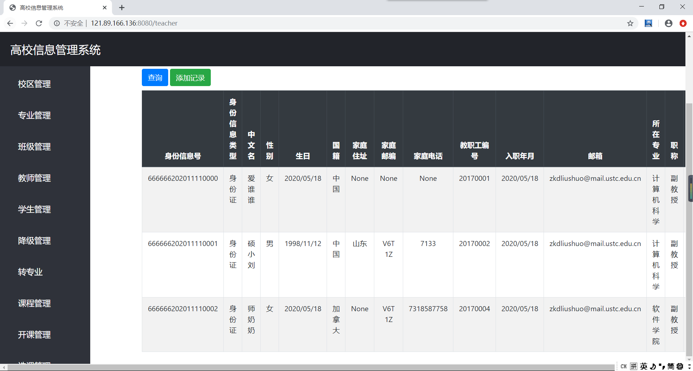
      增加过程
      
      增加结果
      
      非主键内外键复合查询
      
      编辑过程
      
      编辑结果
      
      教师离职过程
      
      
      教师离职结果
      

   ### 班级管理功能

      运行场景
      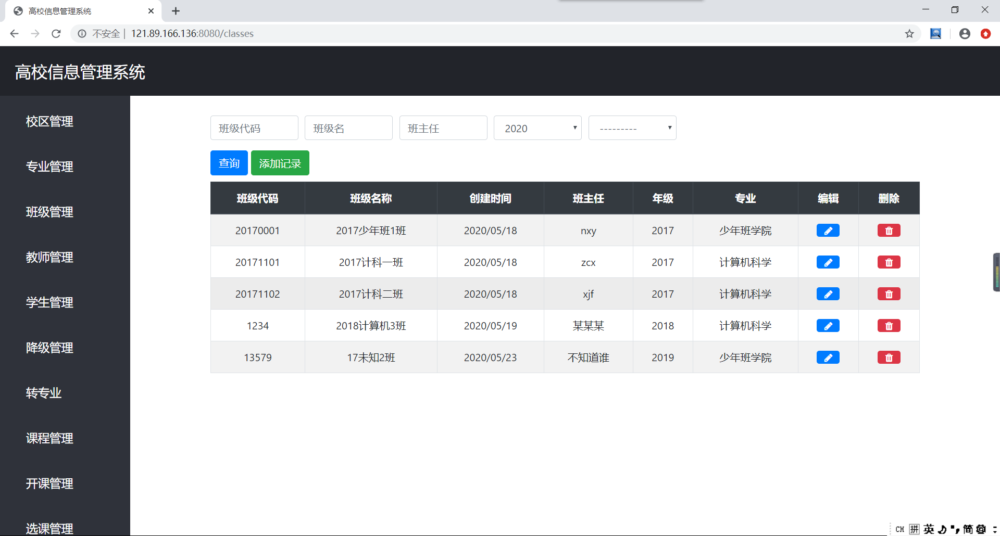
      增加过程
      
      增加结果
      
      主键查询
      
      非主键内外键复合查询
      
      编辑过程
      
      编辑结果
      
      删除结果
      

   ### 校区管理功能

      运行场景
      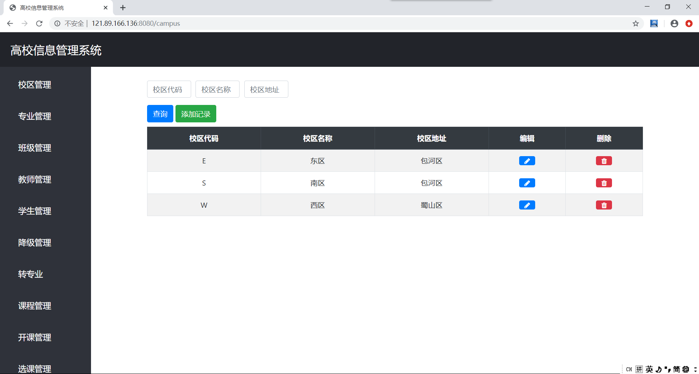
      增加过程
      
      增加结果
      
      主键查询
      
      其他查询
      
      编辑过程
      
      编辑结果
      

   ### 学籍异动管理功能

      降级运行场景
      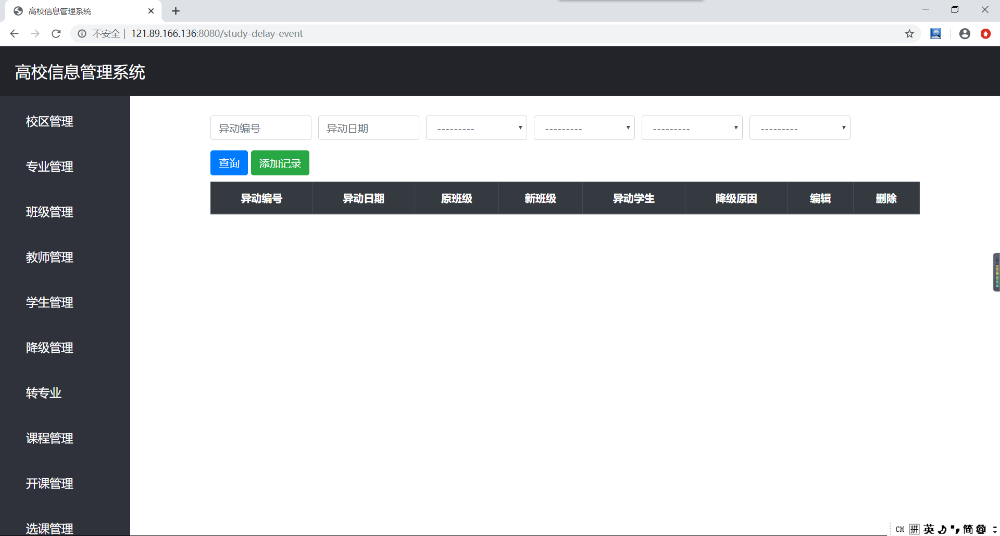
      增加过程
      
      增加结果
      
      非主键查询
      
      编辑过程
      
      编辑结果
      
      转专业运行场景
      
      增加过程
      
      增加结果
      
      不可以删除被其他种类移动依赖的移动
      


   ### 课程管理功能

      运行场景
      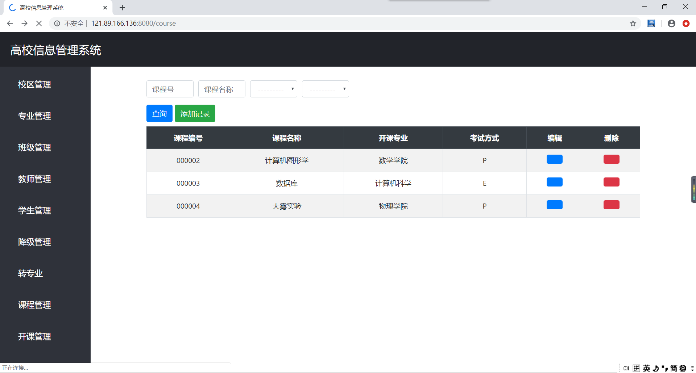
      增加过程
      
      增加结果
      
      外键查询
      
      编辑过程
      
      编辑结果
      

   ### 教师开课管理功能

      运行场景
      
      增加过程
      
      增加结果
      
      编辑过程
      
      编辑结果
      
      试图删除因已经被选过而有关联的开课信息失败
      

   ### 学生选课管理功能

      运行场景
      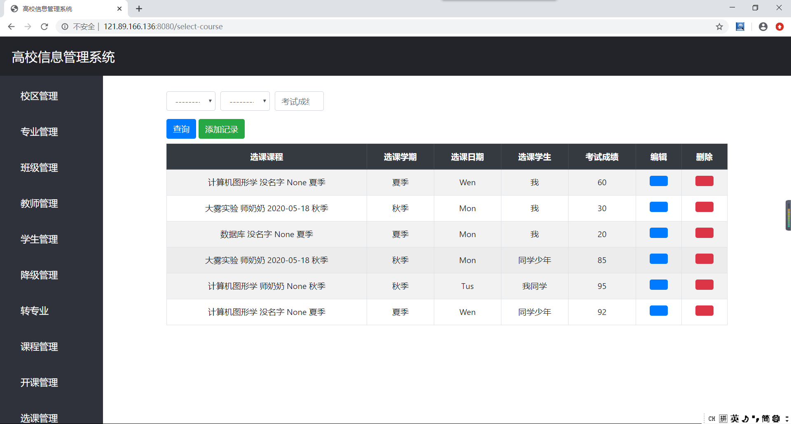
      增加过程
      
      增加结果
      
      编辑过程
      
      编辑结果
      
      主键之一查询
      

## 总结与讨论

### 总结

​	数据库的设计是信息系统的灵魂，这决定了整个程序的设计。

​	一些后端架构使用了灵活的ORM映射，在这个基础上实现数据库模型的设计比较方便，并且debug以及和提供前端使用上功能很强大。

​	信息管理系统中前端过于繁琐。而在Django里面提供了大量可重用的渲染字段，通过ModelForm就可以轻松地把数据库中的字段转化成前端的widget。事实上，尽管Django后端存在很多问题，但是确实节省了我们大量的开发工作。

​	在小组协作中沟通交流很重要。在项目开发的前期我们组有些拖延，沟通也不多。我这个组长有一定的责任。导致现在又几个小bug和一些更好的设计来不及实现。

​	在Django中实现前后端分离的协同开发时，规定好接口很重要。

### 讨论

​	Django的ORM对于时间的支持过于不灵活。这在很多情况下只能通过在前端和在视图中加上相应的处理才能实现时间的改变。

​	教师、班主任、专业负责人的关系应该可以更加完善一下。

## 分工情况

刘硕：组长，负责协调沟通，负责实现数据库的设计以及视图函数的编程，负责协调沟通前后端的接口的设计，负责协调实验报告的编写，负责后期的后端的debug。

万琪：负责实现前端设计，负责实现部分接口设计，负责实现部分视图函数的设计，负责后期的前端debug。

牛田：主要负责实验报告的编写，负责协助开发后端数据库，负责协助开发前端设计，负责开发前后端接口设计。

张鑾翔：负责程序的测试，负责找出程序的bug和设计不合理的地方，并给出建议。负责部分实验报告的编写。

